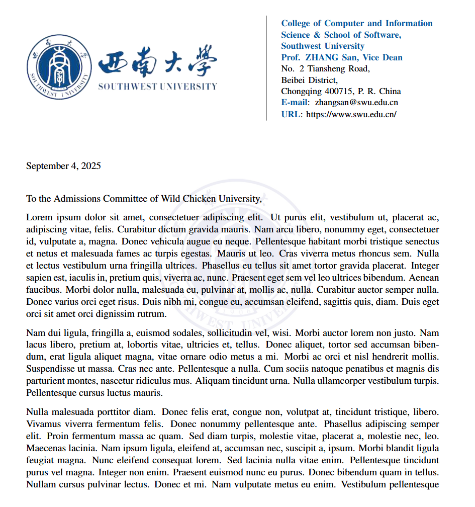

# 西南大学推荐信模板

:page_facing_up: 这是一个用于撰写西南大学推荐信的 LaTeX 模板。

## :one: 使用

### 1. Overleaf

#### 通过模板新建项目

您可以通过以下链接访问 Overleaf 模板并使用：[](https://cn.overleaf.com/read/xjyjxxjknwgd#885bf8)

#### 自行导入 Overleaf

```shell
> git clone https://github.com/UltramanMebiuM78/swu-recommendation-template
```

之后登陆 Overleaf，
```Website
> https://cn.overleaf.com/project
```
新建项目后，将整个文件夹直接上传到项目中。


## :two: 示例



## :three: 使用说明

对于完全不懂Latex语法的同学来说，你需要做的只有如下内容:
1. 将\def\TEL{\textbf{\color{swublue}Phone}: +86-88-8888888}
\def\Email{\textbf{\color{swublue}E-mail}: zhangsan@swu.edu.cn}
\def\URL{\textbf{\color{swublue}URL}: https://www.swu.edu.cn/}中的内容替换为导师信息
2. 将开场问候\opening{To the Admissions Committee of Wild Chicken University,}修改为申请学校的信息
3. 将正文示例，我这里使用的是占位符\lipsum[1-3]，修改为你的推荐信正文内容即可，例如将\lipsum[1-3]完全替换为"I am professor xxx"
4. 将\signature{%\vspace{-12mm}\includegraphics[scale=0.40]{signature_swu.pdf}\\[-2mm]Prof.\ ZHANG San\\}这里的signature_swu.pdf替换为实际的教授电子签名，并将Prof.\ ZHANG San替换为教授实际姓名

